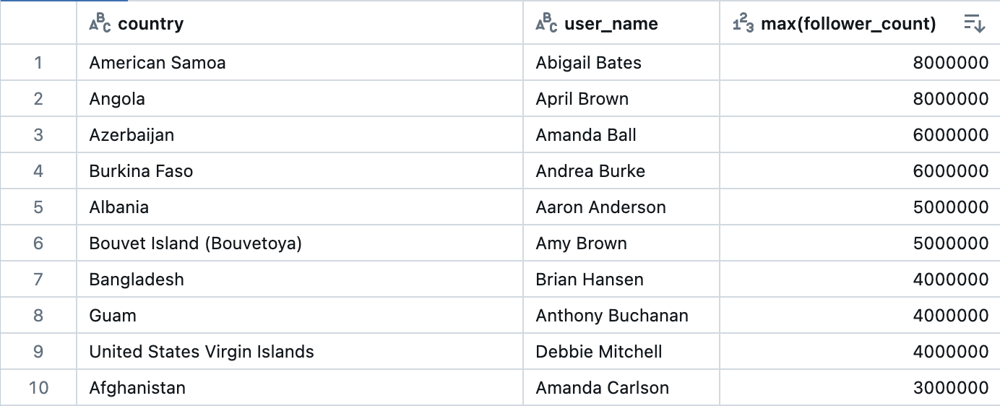

# Pinterest Data Pipeline Project

Pinterest crunches billions of data points every day to decide how to provide more value to their users. In this project, we'll create a similar system using the AWS Cloud.

# Project Overview

This project involves setting up an infrastructure that emulates the data processing pipeline of Pinterest. You will work with simulated data representing user posts, geolocation information, and user details. The project is divided into milestones, with specific tasks to guide you through the setup.


# Table of Contents

- [Getting Started](#getting-started)
- [Data Description](#data-description)
- [Milestones](#milestones)
  - [Milestone 1: Setting Up the Environment](#milestone-1-setting-up-the-environment)
  - [Milestone 2: AWS Integration](#milestone-2-aws-integration)
  - [Milestone 3: Configuring the EC2 Kafka Client](#milestone-3-configuring-the-ec2-kafka-client)
  - [Milestone 4: Connect an MSK Cluster to an S3 Bucket](#milestone-4-connect-an-msk-cluster-to-an-s3-bucket)
  - [Milestone 5: Batch Processing: Configure an API Gateway](#milestone-5-batch-processing-configure-an-api-gateway)
  - [Milestone 6: Mounting S3 Bucket to Databricks and Loading Data](#milestone-6-mounting-s3-bucket-to-databricks-and-loading-data)
  - [Milestone 7: Batch Processing - Spark on Databricks](#milestone-7-batch-processing---spark-on-databricks)
  - [Milestone 8: Batch Processing: AWS MWAA](#milestone-8-batch-processing-aws-mwaa)
  - [Milestone 9: Stream Processing with AWS Kinesis](#milestone-9-stream-processing-with-aws-kinesis)
- [Troubleshooting and Considerations](#troubleshooting-and-considerations)
- [File Structure](#file-structure)
- [Security](#security-considerations)
- [License](#license)

# Getting Started

To get started with this project, follow the steps below:

1. **Download the Project Files**: Obtain the zip package containing the necessary scripts and data files.
2. **Install Dependencies**: Ensure you have Python and necessary libraries installed. You can install required libraries using:
   ```bash
   pip install -r requirements.txt
    ```
# Data Description

The project includes three main data tables:
```
• pinterest_data: Contains data about posts being uploaded to Pinterest.
• geolocation_data: Contains geolocation data for each Pinterest post.
• user_data: Contains data about the users who uploaded each post.
```

# Milestones

## Milestone 1: Setting Up the Environment
**Run the Script:** Execute `user_posting_emulation.py` to simulate user posts and print out `pin_result`, `geo_result`, and `user_result`. These outputs represent one entry in their corresponding tables.

**Database Credentials:** Create a separate `db_creds.yaml` file for the database credentials (`HOST`, `USER`, `PASSWORD` values). Ensure this file is included in your `.gitignore` to avoid uploading sensitive details to GitHub.

## Milestone 2: AWS Integration
**Sign into AWS to start building the pipeline by following these steps:**

**Access Provided RDS:** Use the credentials provided to access the existing RDS instance which contains the necessary tables.

## Milestone 3: Configuring the EC2 Kafka Client

**Task 1:** Create a .pem Key Locally

1. Create Key Pair File:

>- Navigate to Parameter Store in your AWS account.
>- Using your KeyPairId, locate the specific key pair associated with your EC2 instance.
>- Select this key pair and under the Value field, select Show. Copy its entire value (including the BEGIN and END header) and paste it in a .pem file in VSCode.

2. Save Key Pair File:

>- Navigate to the EC2 console and identify the instance with your unique UserId.
>- Select this instance, and under the Details section, find the Key pair name and note it.
>- Save the previously created file in VSCode using the format: `user_id.pem`.

---

**Task 2:** Connect to the EC2 Instance
>- Follow the Connect instructions (SSH client) on the EC2 console to connect to your EC2 instance.

---

**Task 3:** Set Up Kafka on the EC2 Instance
1. Install Kafka:
>- Install Kafka on your client EC2 machine (ensure it matches the cluster version, 2.12-2.8.1).

2. Install IAM MSK Authentication Package:
>- Install the IAM MSK authentication package on your client EC2 machine.

3. Configure IAM Role:
>- Navigate to the IAM console on your AWS account.
>- Select the role with the format: `<your_UserId>-ec2-access-role`.
>- Copy the role ARN and make a note of it.
>- Edit the trust policy to add the principal IAM roles and replace ARN with the copied role ARN.

4. Configure Kafka Client:
>- Modify the client.properties file inside your kafka_folder/bin directory for AWS IAM authentication.

---

**Task 4:** Create the Kafka Topics
1. Retrieve Cluster Information:
>- Obtain the Bootstrap servers string and the Plaintext Apache Zookeeper connection string from the MSK Management Console.

2. Create Topics:
>- Navigate back to the bin folder in your EC2 instance:
```
cd /home/ec2-user/kafka_2.12-2.8.1/bin
```

>- Create the following three topics using the Kafka create topic command:
```
./kafka-topics.sh --bootstrap-server <BootstrapServerString> --command-config client.properties --create --topic <topic_name>
```

>- Ensure your topic names follow the `<your_UserId>.topic_name` syntax to avoid permission errors.

>- On successful topic creation, you will see a message similar to:
```
Created topic <UserID>.geo
```

>- Ensure your CLASSPATH environment variable is set properly and you have installed the aws-msk-iam-auth-1.1.5-all.jar package in the kafka_folder/libs.

## Milestone 4: Connect an MSK Cluster to an S3 Bucket
**Task 1:** Create a custom plugin with MSK connect

- **Step 1:** Go to the S3 console and find the bucket that contains your UserId. The bucket name should have the following format: `user-<your_UserId>-bucket`. Make a note of the bucket name, as you will need it in the next steps.

- **Step 2:** On your EC2 client, download the Confluent.io Amazon S3 Connector **and copy it to the S3 bucket** you have identified in the previous step.
>Connect to your EC2 Instance in your terminal:

    ```
    ssh -i "your_key.pem" ec2-user@your-ec2-instance.amazonaws.com
    ```
    
>Download the S3 connector using the below:

    ```
    wget https://d2p6pa21dvn84.cloudfront.net/api/plugins/confluentinc/kafka-connect-s3/versions/10.5.13/confluentinc-kafka-connect-s3-10.5.13.zip
    ```
    
>Unzip the file by using the `unzip` command as shown below:

    ```
    unzip confluentinc-kafka-connect-s3-10.5.13.zip
    ```
    

- **Step 3:** Create your custom plugin in the MSK Connect console. For this project our AWS account only has permissions to create a custom plugin with the following name: `<your_UserId>-plugin`. Make sure to use this name when creating your plugin.
>The plugin object can be input as:
    ```
    s3://<user_bucket>>/confluentinc-kafka-connect-s3-10.5.13.zip
    ```
---

**Task 2:** Create a connector with MSK connect

- For this project our AWS account only has permissions to create a connector with the following name: `<your_UserId>-connector`. **Make sure to use this name when creating your connector.**

**Make sure to use the correct configurations for your connector:**
```python
connector.class=io.confluent.connect.s3.S3SinkConnector
# same region as our bucket and cluster
s3.region=us-east-1
flush.size=1
schema.compatibility=NONE
tasks.max=3
# include nomeclature of topic name, given here as an example will read all data from topic names starting with msk.topic....
topics.regex=`<YOUR_UUID>`.*
format.class=io.confluent.connect.s3.format.json.JsonFormat
partitioner.class=io.confluent.connect.storage.partitioner.DefaultPartitioner
value.converter.schemas.enable=false
value.converter=org.apache.kafka.connect.json.JsonConverter
storage.class=io.confluent.connect.s3.storage.S3Storage
key.converter=org.apache.kafka.connect.storage.StringConverter
s3.bucket.name=`<BUCKET_NAME>`
```

- Pay attention to the topics.regex field in the connector configuration. Make sure it has the following structure: `<your_UserId>.*`.
>This will ensure that data going through all the three previously created Kafka topics will get saved to the S3 bucket.

- When building the connector, make sure to choose the IAM role used for authentication to the MSK cluster in the Access permissions tab. Remember the role has the following format `<your_UserId>-ec2-access-role`. This is the same role you have previously used for authentication on your EC2 client, and contains all the necessary permissions to connect to both MSK and MSK Connect.

- Now that you have built the plugin-connector pair, data passing through the IAM authenticated cluster, will be automatically stored in the designated S3 bucket.


## Milestone 5: Batch Processing: Configure an API Gateway

**Task 1**: Build a Kafka REST proxy integration for your API.

For this project, you will not need to create your own API, as you have been provided with one already. The API name will be the same as your UserId.

- **Step 1**:  
   Create a resource that allows you to build a PROXY integration for your API.

- **Step 2**:  
   For the previously created resource, create an HTTP ANY method. When setting up the Endpoint URL, make sure to copy the correct PublicDNS from the EC2 machine you have been working on in the previous milestones. Remember, this EC2 should have the same name as your UserId.

- **Step 3**:  
   Deploy the API and make a note of the Invoke URL, as you will need it in a later task.

---

**Task 2**: Set up the Kafka REST Proxy on the EC2 Client

Now that you have set up the Kafka REST Proxy integration for your API, you need to set up the Kafka REST Proxy on your EC2 client machine.

- **Step 1**:  
   Download and extract the Confluent package for the Kafka REST Proxy on your EC2 client machine using the following command:
   ```bash
   wget https://packages.confluent.io/archive/7.2/confluent-7.2.0.tar.gz
   tar -xzf confluent-7.2.0.tar.gz

- **Step 2**:
    Configure the kafka-rest.properties file to allow the REST proxy to perform IAM authentication to the MSK cluster. Use the following commands to navigate and edit the configuration:
    ```
    cd confluent-7.2.0/
    cd bin/
    nano kafka-rest.properties
    ```

    Make sure the kafka-rest.properties file includes the following configuration:
    ```
    zookeeper.connect=<your_zookeeper_string>

    bootstrap.servers=<your_bootstrap_string>

    # Configure interceptor classes for sending consumer and producer metrics to Confluent Control Center
    # Make sure that monitoring-interceptors-<version>.jar is on the Java class path
    #consumer.interceptor.classes=io.confluent.monitoring.clients.interceptor.MonitoringConsumerInterceptor
    #producer.interceptor.classes=io.confluent.monitoring.clients.interceptor.MonitoringProducerInterceptor

    # Sets up TLS for encryption and SASL for authN.
    client.security.protocol = SASL_SSL

    # Identifies the SASL mechanism to use.
    client.sasl.mechanism = AWS_MSK_IAM

    # Binds SASL client implementation.
    client.sasl.jaas.config = software.amazon.msk.auth.iam.IAMLoginModule required awsRoleArn="<your_IAM_access_role_ARN>";

    # Encapsulates constructing a SigV4 signature based on extracted credentials.
    # The SASL client bound by "sasl.jaas.config" invokes this class.
    client.sasl.client.callback.handler.class = software.amazon.msk.auth.iam.IAMClientCallbackHandler
    ```
- **Step 3**:
    Start the REST proxy on the EC2 client machine by doing the following:
    1. Navigate to the `bin` folder within the `confluent-7.2.0` folder:
    ```
    cd confluent-7.2.0/
    cd bin/
    ```
    2. Run the following command:
    ```
    ./kafka-rest-start /home/ec2-user/confluent-7.2.0/etc/kafka-rest/kafka-rest.properties
    ```

---

**Task 3**: Send Data to the API

You are ready to send data to your API, which in turn will send the data to the MSK Cluster using the plugin-connector pair previously created.

- **Step 1**:
Modify the `user_posting_emulation.py` file to send data to your Kafka topics using your API Invoke URL. You should send data from the three tables to their corresponding Kafka topic.

**In my case, what I did was**:
>1. Define a method called `send_to_api()`.
>2. Create a `config.py` file to hold all of the private parts of the code and added the API Invoke URLs into it like so (making sure to add `config.py` to `.gitignore`):

    ```python
    BASE_API_INVOKE_URL = '<your_API_Invoke_URL>'
    PIN_API_INVOKE_URL = f'{BASE_API_INVOKE_URL}/topics/<your_ID>.pin'
    GEO_API_INVOKE_URL = f'{BASE_API_INVOKE_URL}/topics/<your_ID>.geo'
    USER_API_INVOKE_URL = f'{BASE_API_INVOKE_URL}/topics/<your_ID>.user'
    ```
    
>4. In `user_posting_emulation.py`, import the topic specific URLs from config:

    ```
    from config import PIN_API_INVOKE_URL, GEO_API_INVOKE_URL, USER_API_INVOKE_URL
    ```
    
>6. Within the `run_infinite_post_data_loop()` method, call the `send_to_api` method for each topic, making sure to add the 3 constants for each API Invoke URL:

    ```python
    # Send data to the corresponding API URLs
        send_to_api(PIN_API_INVOKE_URL, pin_result)
        send_to_api(GEO_API_INVOKE_URL, geo_result)
        send_to_api(USER_API_INVOKE_URL, user_result)
    ```

- **Step 2**:
Check data is sent to the cluster by running a Kafka consumer (one per topic). If everything has been set up correctly, you should see messages being consumed.

**Probably the simplest way to do this is as follows**:

1. Navigate to the Kafka bin/ Directory:

    - First, SSH into your EC2 instance where Kafka is installed.
    Navigate to the Kafka bin/ directory, where the Kafka scripts are located.

        ```
        cd /home/ec2-user/confluent-7.2.0/bin/
        ```

2. Run a Kafka Consumer:

    - Use the kafka-console-consumer.sh script to start a consumer for each of your topics. The consumer will connect to your Kafka cluster and read the messages from the specified topic.
    For example, to consume messages from the <your_UserId>.pin topic, you would run:

        ```
        ./kafka-console-consumer.sh --bootstrap-server <your_bootstrap_server> --topic <your_UserId>.pin --from-beginning --consumer.config client.properties
        ```
    Replace <your_bootstrap_server> with your actual bootstrap server address and <your_UserId>.pin with the correct topic name.

    - You should see messages being consumed and printed to the terminal. This output indicates that data is successfully being sent to the Kafka cluster and the consumer is reading it.

3. Repeat for Each Topic:

    - Run a separate consumer for each of your Kafka topics (e.g., <your_UserId>.geo, <your_UserId>.user) to ensure that data is being ingested across all topics.
        ```
        ./kafka-console-consumer.sh --bootstrap-server <your_bootstrap_server> --topic <your_UserId>.geo --from-beginning --consumer.config client.properties
        ```
        ```
        ./kafka-console-consumer.sh --bootstrap-server <your_bootstrap_server> --topic <your_UserId>.user --from-beginning --consumer.config client.properties
        ```

- **Step 3**:
Check if data is getting stored in the S3 bucket. Notice the folder organization (e.g., `topics/<your_UserId>.pin/partition=0/`) that your connector creates in the bucket. Make sure your database credentials are encoded in a separate, hidden `db_creds.yaml` file.


## Milestone 6: Mounting S3 Bucket to Databricks and Loading Data

In this milestone, the task was to securely mount an S3 bucket to Databricks and load data into Spark DataFrames for subsequent analysis. This process involved using AWS credentials stored in a Delta table to mount the S3 bucket and then reading JSON data into separate DataFrames.

### Steps Involved

1. **Loading AWS Credentials from Delta Table:**
   - The AWS Access Key and Secret Access Key are securely loaded from a Delta table stored at a specified path within Databricks.

2. **Encoding the Secret Key:**
   - The secret key is URL-encoded to ensure secure transmission when constructing the S3 source URL.

3. **Constructing the S3 Source URL:**
   - A URL is constructed that incorporates the AWS credentials, which allows Databricks to access the specified S3 bucket.

4. **Mounting the S3 Bucket:**
   - The S3 bucket is mounted to the Databricks File System (DBFS) at a specified mount point, making the contents of the bucket accessible via DBFS.

5. **Loading JSON Data into DataFrames:**
   - JSON files from the mounted S3 bucket are loaded into three separate DataFrames:
     - `df_pin`: Contains Pinterest post data.
     - `df_geo`: Contains geolocation data.
     - `df_user`: Contains user data.
---

### Example Code for DataBricks Notebook

    ```python
        # Step 1: Load AWS credentials from Delta table
        delta_table_path = "dbfs:/<path_to_authentication_credentials>"
        aws_keys_df = spark.read.format("delta").load(delta_table_path)
    
        # Step 2: Extract and encode credentials
        ACCESS_KEY = aws_keys_df.select('Access key ID').collect()[0]['Access key ID']
        SECRET_KEY = aws_keys_df.select('Secret access key').collect()[0]['Secret access key']
        ENCODED_SECRET_KEY = urllib.parse.quote(string=SECRET_KEY, safe="")
    
        # Step 3: Define the S3 bucket name and mount point
        AWS_S3_BUCKET = "<your_user_bucket>"
        MOUNT_NAME = "/mnt/<your_mount_name>"
        SOURCE_URL = f"s3n://{ACCESS_KEY}:{ENCODED_SECRET_KEY}@{AWS_S3_BUCKET}"
    
        # Step 4: Mount the S3 bucket
        dbutils.fs.mount(SOURCE_URL, MOUNT_NAME)
    
        # Step 5: Define paths to the JSON files in the S3 bucket
        path_pin = f"{MOUNT_NAME}/topics/<your_UserId>.pin/partition=0/"
        path_geo = f"{MOUNT_NAME}/topics/<your_UserId>.geo/partition=0/"
        path_user = f"{MOUNT_NAME}/topics/<your_UserId>.user/partition=0/"
    
        # Step 6: Disable format checks during the reading of Delta tables
        %sql
        SET spark.databricks.delta.formatCheck.enabled=false
    
        # Step 7: Load the JSON data into DataFrames with schema inference
        try:
            df_pin = spark.read.format("json") \
                .option("inferSchema", "true") \
                .load(path_pin)
            
            df_geo = spark.read.format("json") \
                .option("inferSchema", "true") \
                .load(path_geo)
            
            df_user = spark.read.format("json") \
                .option("inferSchema", "true") \
                .load(path_user)
    
            # Display loaded data to verify successful loading
            print("Pinterest Data:")
            display(df_pin)
    
            print("Geolocation Data:")
            display(df_geo)
    
            print("User Data:")
            display(df_user)
    
        except Exception as e:
        print(f"Error loading data from S3: {str(e)}")
    ```

### Output
Upon successful execution, the script prints out sample data from each DataFrame to verify that the JSON files have been loaded correctly.

---

### Notes
- Make sure to replace placeholders like `your_user_bucket`, `your_mount_name`, and `your_UserId` with actual values corresponding to your S3 bucket, mount point, and user ID.

- If the mounting fails, an error message will be printed with the details.

- By completing this milestone, the data required for analysis has been successfully loaded into Databricks, making it ready for further processing and querying.

- If you ever have an error saying you've already mounted the bucket, and for whatever reason need to unmount then re-mount, you can use the code: `(Optional): Unmount S3 bucket
If you want to unmount the S3 bucket, run the following code:
    ```
    dbutils.fs.unmount("/mnt/mount_name")
    ```
- **Security**: 
    - ***DO NOT UNDER ANY CIRCUMSTANCE UPLOAD YOUR RAW CREDENTIALS ANYWHERE, ESPECIALLY TOGETHER WITH YOUR CODE ON GITHUB. EXPOSED CREDENTIALS ARE JUST ABOUT THE WORST THING A PROGRAMMER CAN DO.***
    - Databricks is generally quite secure and you would need access to the workspace in order to access the credentials.
    - However, as an extra precaution, you could create 2 notebooks in DataBricks, one for credentials, and the other to run the mounting script - using the command `%run <file_path_to_credentials_notebook>` to securely import the credentials without exposing them. If you do this though, the cell that you run this command in cannot contain any comments, as there isa bug that prevents it from reading the file path correctly.
    - As a general rule, pursue implementing as much security as you reasonably can.

## Milestone 7: Batch Processing - Spark on Databricks

This milestone focuses on data cleaning, processing, and querying using Apache Spark on Databricks. The goal is to apply Spark transformations to clean and compute insights from various datasets, with a focus on Pinterest posts, geolocation, and user information.

### Task 1: Clean the Pinterest Posts DataFrame

- **Objective**: Clean the `df_pin` DataFrame containing information about Pinterest posts.
- **Steps**:
  1. Replace empty entries and irrelevant data with `None`.
  2. Ensure the `follower_count` column is properly formatted as an integer.
  3. Convert numeric columns to appropriate data types.
  4. Clean the `save_location` column to include only the save location path.
  5. Rename the `index` column to `ind`.
  6. Reorder the DataFrame columns according to the specified order.
  
- **Outcome**: A cleaned Pinterest posts DataFrame with correctly formatted and ordered columns.

  

---

### Task 2: Clean the Geolocation DataFrame

- **Objective**: Clean the `df_geo` DataFrame containing geolocation information.
- **Steps**:
  1. Create a new column `coordinates` that contains an array based on the `latitude` and `longitude` columns.
  2. Drop the original `latitude` and `longitude` columns.
  3. Convert the `timestamp` column from a string to a timestamp data type.
  4. Reorder the DataFrame columns according to the specified order.
  
- **Outcome**: A cleaned geolocation DataFrame with combined coordinates and correctly formatted timestamps.

  

---

### Task 3: Clean the User DataFrame

- **Objective**: Clean the `df_user` DataFrame containing user information.
- **Steps**:
  1. Create a new column `user_name` by concatenating `first_name` and `last_name`.
  2. Drop the original `first_name` and `last_name` columns.
  3. Convert the `date_joined` column from a string to a timestamp data type.
  4. Reorder the DataFrame columns according to the specified order.
  
- **Outcome**: A cleaned user DataFrame with full user names and correctly formatted join dates.

  

### *Before querying the DataFrames*
1. **Consider how you're going to query the data**
- Personally, I prefer to have seperate notebooks for each task, so in order to share/access the cleaned DataFrames across different notebooks within the same spark session I opted for a fairly simple method of doing this:

2. **Global Temporary Views**:
- These allow you to easily access and merge data across different notebooks within the same Spark session.

> To create one of these, you can simply use the following syntax:
```
# Create global temporary views
<cleaned_dataframe>.create0rReplaceGlobalTempView("<global_cleaned_dataframe>") # Be sure to replace the df names with your own
```
- Make sure to do this for all three of your df's (`pin`, `geo`, `user`).

3. **Once our Global Temporary Views have been made, we can create our notebook for querying the dataframes.**
- Upon creating our `Querying Notebook`, we'll need to read these Global Temporary Views into our notebook in order to perform any queries.

> To do this, we use the following syntax:
```
# Access the global temporary views
<cleaned_dataframe> = spark.read.table("<global_temp.global_cleaned_dataframe>")
```
- Again, make sure to do this for all three of your df's (`pin`, `geo`, `user`).

4. **Display your original Cleaned DataFrames in their own respective cells**
- This is important to do in order to keep a reference of what the original table looks like, so you can figure out how to best approach what dfs to merge together for the respective tasks.
```
display(<cleaned_dataframe>)
```

**Now we can move on to querying the DataFrames!**


## Querying the Data
***Please Keep In Mind That: The data is randomly loaded into the S3 bucket, and therefore our results will all look different***

### Task 4: Find the Most Popular Category in Each Country

- **Objective**: Identify the most popular Pinterest category in each country.
- **Steps**:
  1. Join `df_pin_cleaned` with `df_geo_cleaned` on the `ind` column.
  2. Group by `country` and `category`, then count the number of posts in each category per country.
  3. Rank the categories by count within each country.
  4. Filter to keep only the most popular category per country.
  
- **Outcome**: A DataFrame showing the most popular category in each country based on post counts.

  

---

### Task 5: Find the Most Popular Category in Each Year (2018 - 2022)

- **Objective**: Identify the most popular Pinterest category in each year between 2018 and 2022.
- **Steps**:
  1. Join df_pin_cleaned with df_geo_cleaned on the ind column.
  2. Extract the year from the timestamp column to create a post_year column.
  3. Filter the data to include only posts between 2018 and 2022.
  4. Group by post_year and category, then count the number of posts in each category per year.
  5. Define a window specification to rank categories by count within each year.
  6. Apply the window function to add a rank column.
  7. Filter to keep only the most popular category per year (rank == 1).

- **Outcome**: A DataFrame showing the most popular category in each year based on post counts.

  

---

### Task 6: Find the User with the Most Followers in Each Country

- **Objective**: Find the user with the most followers in each country and the country with the most followed user.
- **Steps**:
  1. Join `df_pin_cleaned`, `df_geo_cleaned`, and `df_user_cleaned` on the `ind` column.
  2. Group by `country` and `user_name` to find the maximum `follower_count` per user.
  3. Rank users by follower count within each country and filter to keep the top user.
  4. Rank countries by the top user's follower count and filter for the top-ranked country.
  
- **Outcome**: A DataFrame showing the most followed user in each country and the country with the highest follower count.

  
  

---

### Task 7: Find the Most Popular Category for Different Age Groups

- **Objective**: Identify the most popular Pinterest category based on different age groups.
- **Steps**:
  1. Join `df_pin_cleaned` with `df_user_cleaned` on the `ind` column.
  2. Create an `age_group` column based on the `age` column.
  3. Group by `age_group` and `category`, then count the number of posts in each category per age group.
  4. Rank the categories by count within each age group and filter to keep the most popular category.
  
- **Outcome**: A DataFrame showing the most popular Pinterest categories across different age groups.

  

---

### Task 8: Find the Median Follower Count for Different Age Groups

- **Objective**: Calculate the median follower count for users in different age groups.
- **Steps**:
  1. Join `df_pin_cleaned` with `df_user_cleaned` on the `ind` column.
  2. Create an `age_group` column based on the `age` column.
  3. Group by `age_group` and calculate the median `follower_count`.
  
- **Outcome**: A DataFrame showing the median follower count across different age groups.

  

---

### Task 9: Find How Many Users Have Joined Each Year

- **Objective**: Determine how many users joined each year between 2015 and 2020.
- **Steps**:
  1. Extract the year from the `date_joined` column to create a `post_year` column.
  2. Filter for years between 2015 and 2020.
  3. Group by `post_year` and count the number of users who joined each year.
  
- **Outcome**: A DataFrame showing the number of users who joined each year from 2015 to 2020.

  

---

### Task 10: Find the Median Follower Count Based on Joining Year

- **Objective**: Calculate the median follower count of users based on their joining year (2015-2020).
- **Steps**:
  1. Join `df_pin_cleaned` with `df_user_cleaned` on the `ind` column.
  2. Extract the year from the `date_joined` column to create a `post_year` column.
  3. Filter for years between 2015 and 2020.
  4. Group by `post_year` and calculate the median `follower_count`.
  
- **Outcome**: A DataFrame showing the median follower count for users based on their joining year.

  

---

### Task 11: Find the Median Follower Count Based on Joining Year and Age Group

- **Objective**: Determine the median follower count of users based on their joining year and age group (2015-2020).
- **Steps**:
  1. Join `df_pin_cleaned` with `df_user_cleaned` on the `ind` column.
  2. Extract the year from the `date_joined` column to create a `post_year` column.
  3. Create an `age_group` column based on the `age` column.
  4. Filter for years between 2015 and 2020.
  5. Group by `age_group` and `post_year`, then calculate the median `follower_count`.
  
- **Outcome**: A DataFrame showing the median follower count for users based on their joining year and age group.

  


## Milestone 8: Batch Processing: AWS MWAA

In this milestone, we orchestrated Databricks workloads using Amazon Managed Workflows for Apache Airflow (MWAA). The objective was to automate the data cleaning process and other related tasks by scheduling them using Airflow DAGs.

### Task 1: Create and Upload a DAG to a MWAA Environment

- **Objective**: Set up an Airflow DAG to automate the execution of the data cleaning notebook in Databricks.

- **Steps**:
  1. Use the provided DAG template to create the Airflow DAG file:
  
      ```python
      from airflow import DAG
      from airflow.providers.databricks.operators.databricks import DatabricksSubmitRunOperator, DatabricksRunNowOperator
      from datetime import datetime, timedelta 

      # Define params for Submit Run Operator
      notebook_task = {
          'notebook_path': '<DATABRICKS_NOTEBOOK_PATH>',
      }

      # Define params for Run Now Operator
      notebook_params = {
          "Variable": 5
      }

      default_args = {
          'owner': '<OWNER_NAME>',
          'depends_on_past': False,
          'email_on_failure': False,
          'email_on_retry': False,
          'retries': <NUMBER_DESIRED_RETRIES>,
          'retry_delay': timedelta(minutes=2)
      }

      with DAG('databricks_dag',
          start_date=<DESIRED_START_DATE>,
          schedule_interval='<DESIRED_INTERVAL>',
          catchup=False,
          default_args=default_args
          ) as dag:

          opr_submit_run = DatabricksSubmitRunOperator(
              task_id='submit_run',
              databricks_conn_id='databricks_default',
              existing_cluster_id='<CLUSTER_ID>',
              notebook_task=notebook_task
          )
          opr_submit_run
      ```

  2. Fill in the placeholders:
     - `<DATABRICKS_NOTEBOOK_PATH>`: Full path to your Databricks notebook.
     - `<OWNER_NAME>`: Your name or identifier.
     - `<NUMBER_DESIRED_RETRIES>`: Number of retries in case of failure. 3-5 is fine.
     - `<DESIRED_START_DATE>`: Start date of the DAG in `datetime` format.
     - `<DESIRED_INTERVAL>`: Schedule interval (e.g., daily).
     - `<CLUSTER_ID>`: The ID of the Databricks cluster. Can be found under `Compute`>`Your_Cluster`>`More`>`View JSON`>`Cluster ID`.

  3. Upload the DAG file to the `dags` folder in the `mwaa-dags-bucket` S3 bucket.
  

- **Outcome**: Successfully created and deployed a DAG in MWAA that automates the execution of the Databricks data cleaning notebook.

---

### Task 2: Trigger a DAG that Runs a Databricks Notebook

- **Objective**: Manually trigger the DAG you created and check its execution status.

- **Steps**:
  1. Access the Airflow UI.
  2. Locate the DAG you uploaded in Task 1.
  3. Manually trigger the DAG to execute the Databricks notebook.
  4. Monitor the execution and ensure the DAG completes successfully.
  5. If the DAG fails, check the logs within Airflow to identify the error. In my case, the error was due to a missing import of a function in the notebook. Amend the error and retest until successful.

  - You can check to see the success from various dashboard views within Airflow - the quickest being from the `DAGs` tab. However, to see the Tree of triggered instances, their successes and failures, you can click on the name of your DAG and make sure you're on the `Tree` tab (pictured below).

- **Outcome**: The DAG was triggered successfully, and any encountered issues were resolved by checking the logs and adjusting the notebook accordingly.

  


## Milestone 9: Stream Processing with AWS Kinesis

This README will guide you through setting up and configuring your AWS Kinesis streams, API Gateway, and Python scripts to send data to the Kinesis streams and perform CRUD operations.


### Task 1: Create Data Streams Using Kinesis Data Streams

1. **Stream Naming Convention**:
   Ensure that your AWS account has been granted permissions to create and describe the following streams:
   - `streaming-<your_UserId>-pin`
   - `streaming-<your_UserId>-geo`
   - `streaming-<your_UserId>-user`

   **Note**: Follow the correct naming convention to avoid permission errors.

2. **Creating Streams**:
   - Navigate to the AWS Kinesis service in the AWS Management Console.
   - Create three data streams using the provided naming conventions.

---

### Task 2: Configure an API with Kinesis Proxy Integration

1. **Create API and Set Up Resources**:
   - Navigate to the API Gateway service.
   - Create a new REST API or use an existing one.

2. **Integration with AWS Kinesis**:
   - Under your API’s resources, create a new resource named `/streams`.
   - For the `/streams` resource, create the following HTTP methods:
     - **POST**: List streams in Kinesis.
     - **GET**: Get details of a specific stream.
     - **DELETE**: Delete a specific stream.

3. **Setting up HTTP Methods**:

   - **List Streams (POST)**:
     - Resource: `/streams`
     - Integration type: AWS Service
     - AWS Region: `us-east-1`
     - AWS Service: `Kinesis`
     - HTTP method: `POST`
     - Action: `ListStreams`
     - Execution Role: `<your_UserId>-kinesis-access-role`
     - Integration request: Add `Content-Type` header as `application/x-amz-json-1.1` (see [Content-Type Explanation](#content-type-applicationxamzjson-in-aws-requests))
     - Mapping Template: `{}`

   - **Describe Stream (GET)**:
     - Resource: `/streams/{stream-name}`
     - Integration type: AWS Service
     - AWS Region: `us-east-1`
     - AWS Service: `Kinesis`
     - HTTP method: `POST`
     - Action: `DescribeStream`
     - Execution Role: `<your_UserId>-kinesis-access-role`
     - Integration request: Add `Content-Type` header as `application/x-amz-json-1.1` (see [Content-Type Explanation](#content-type-applicationxamzjson-in-aws-requests))
     - Mapping Template:
       ```json
       {
           "StreamName": "$input.params('stream-name')"
       }
       ```

   - **Create Stream (POST)**:
     - Resource: `/streams/{stream-name}`
     - Integration type: AWS Service
     - AWS Region: `us-east-1`
     - AWS Service: `Kinesis`
     - HTTP method: `POST`
     - Action: `CreateStream`
     - Execution Role: `<your_UserId>-kinesis-access-role`
     - Integration request: Add `Content-Type` header as `application/x-amz-json-1.1` (see [Content-Type Explanation](#content-type-applicationxamzjson-in-aws-requests))
     - Mapping Template:
       ```json
       {
           "ShardCount": "#if($input.path('$.ShardCount') == '') 5 #else $input.path('$.ShardCount') #end",
           "StreamName": "$input.params('stream-name')"
       }
       ```

   - **Delete Stream (DELETE)**:
     - Resource: `/streams/{stream-name}`
     - Integration type: AWS Service
     - AWS Region: `us-east-1`
     - AWS Service: `Kinesis`
     - HTTP method: `POST`
     - Action: `DeleteStream`
     - Execution Role: `<your_UserId>-kinesis-access-role`
     - Integration request: Add `Content-Type` header as `application/x-amz-json-1.1` (see [Content-Type Explanation](#content-type-applicationxamzjson-in-aws-requests))
     - Mapping Template:
       ```json
       {
           "StreamName": "$input.params('stream-name')"
       }
       ```

   - **Add Record to Stream (PUT)**:
     - Resource: `/streams/{stream-name}/record`
     - Integration type: AWS Service
     - AWS Region: `us-east-1`
     - AWS Service: `Kinesis`
     - HTTP method: `PUT`
     - Action: `PutRecord`
     - Execution Role: `<your_UserId>-kinesis-access-role`
     - Integration request: Add `Content-Type` header as `application/x-amz-json-1.1` (see [Content-Type Explanation](#content-type-applicationxamzjson-in-aws-requests))
     - Mapping Template:
        **Original had "bug", please see the fix for this here:** [API Gateway Mapping Template Discrepancies](#api-gateway-mapping-template-discrepancies)
       ```json
       {
           "StreamName": "$input.params('stream-name')",
           "Data": "$util.base64Encode($input.json('$.Data'))",
           "PartitionKey": "$input.path('$.PartitionKey')"
       }
       ```

   - **Add Multiple Records to Stream (PUT)**:
     - Resource: `/streams/{stream-name}/records`
     - Integration type: AWS Service
     - AWS Region: `us-east-1`
     - AWS Service: `Kinesis`
     - HTTP method: `PUT`
     - Action: `PutRecords`
     - Execution Role: `<your_UserId>-kinesis-access-role`
     - Integration request: Add `Content-Type` header as `application/x-amz-json-1.1` (see [Content-Type Explanation](#content-type-applicationxamzjson-in-aws-requests))
     - Mapping Template:
       ```json
       {
           "StreamName": "$input.params('stream-name')",
           "Records": [
               #foreach($elem in $input.path('$.records'))
               {
                   "Data": "$util.base64Encode($elem.data)",
                   "PartitionKey": "$elem.partition-key"
               }#if($foreach.hasNext),#end
               #end
           ]
       }
       ```

---

### Task 3: Sending Data to Kinesis Streams

1. **Edit the `user_posting_emulation_streaming.py` script**:
   1. Create a duplicate of the `user_posting_emulation.py` script.
   2. Create a new function called `send_to_kinesis()` that looks like this:
      ```python
        def send_to_kinesis(url: str, stream_name: str, data: dict):
        """
        Sends data to the Kinesis stream via the API Gateway.

        :param url: The full API URL for the specific stream.
        :param stream_name: The name of the Kinesis stream.
        :param data: The data to be sent as a dictionary.
        """
        # Serialize the payload to JSON format, including the stream name and partition key
        json_payload = json.dumps({
            "StreamName": stream_name,
            "Data": json.dumps(data),
            "PartitionKey": "partition-key"  # Replace with a suitable partition key if needed
        })

        # Set the necessary headers for the request
        headers = {'Content-Type': 'application/json'}

        # Send the JSON payload to the API using the PUT method
        response = requests.request("PUT", url, headers=headers, data=json_payload)

        # Check the response status and print appropriate messages
        if response.status_code == 200:
            print(f"Response Status Code: {response.status_code}. Successfully sent data to {url}.")
        else:
            print(response.status_code)
            print(f"Failed to send data to {url}. Response: {response.text}")
      ```
   3. Then to the end of your `run_infinite_post_data_loop()` function, add the below:
      ```python
            # Make sure timestamp formats are converted to a string so they are JSON serializable, otherwise you'll get an error.
            geo_result['timestamp'] = geo_result['timestamp'].isoformat()
            user_result['date_joined'] = user_result['date_joined'].isoformat()

            # Send data to the corresponding Kinesis streams via the API Gateway
            send_to_kinesis(PIN_API_INVOKE_URL, PIN_STREAM, pin_result)
            send_to_kinesis(GEO_API_INVOKE_URL, GEO_STREAM, geo_result)
            send_to_kinesis(USER_API_INVOKE_URL, USER_STREAM, user_result)

            print("Data sent to Kinesis streams via API Gateway")
      ```
   4. Finally, edit your `config.py` file to reflect the new task of interacting with Kinesis - it should look something like this:
      ```python
        """
        This config file contains the necessary URLs and stream names for interacting with AWS Kinesis streams.
        """

        # API Invoke URLs for each stream (replace with your own stream-specific URLs)
        PIN_API_INVOKE_URL = 'https://your-api-invoke-url.amazonaws.com/YourStage/streams/streaming-<your_user_ID>-pin/record'
        GEO_API_INVOKE_URL = 'https://your-api-invoke-url.amazonaws.com/YourStage/streams/streaming-<your_user_ID>-geo/record'
        USER_API_INVOKE_URL = 'https://your-api-invoke-url.amazonaws.com/YourStage/streams/streaming-<your_user_ID>-user/record'

        # Stream names (replace with your own stream names)
        PIN_STREAM = 'streaming-<your_user_ID>-pin'
        GEO_STREAM = 'streaming-<your_user_ID>-geo'
        USER_STREAM = 'streaming-<your_user_ID>-user'
      ```
    >- ***It's worth noting that your `config.py` will also likely contain details for your kafka topics.***
    >- ***you can safely comment these out using either `#` or `multiline comments: """<your-text-here>"""`***

   **Make sure to**:
    - Set the HTTP method in your script is to `requests.request("PUT")` to match the API Gateway configuration.
    - Use the correct API Invoke URL in your script.

2. **Test your setup**:
   - Ensure that the API and Kinesis streams are correctly configured.
   - Feel free to use the provided template - note, this requires hard coding, so as long as you're not posting it anywhere public it is fine to use, otherwise - for  amore security conscious approach for posting anywhere public, please follow the above instructions outlines in step 1.

---

   **Foundational API Test Template Script**:
    ```python
        import requests
        import json

        example_df = {"index": 1, "name": "<test_name>", "age": 25, "role": "engineer"}

        # invoke url for one record, if you want to put more records replace record with records
        invoke_url = "https://YourAPIInvokeURL/<YourDeploymentStage>/streams/<stream_name>/record"

        #To send JSON messages you need to follow this structure
        payload = json.dumps({
            "StreamName": "YourStreamName",
            "Data": {
                    #Data should be send as pairs of column_name:value, with different columns separated by commas
                    "index": example_df["index"], "name": example_df["name"], "age": example_df["age"], "role": example_df["role"]
                    },
                    "PartitionKey": "desired-name"
                    })

        headers = {'Content-Type': 'application/json'}

        response = requests.request("PUT", invoke_url, headers=headers, data=payload)

        # Print the HTTP response code and body
        print("Status Code:", response.status_code)
        print("Response Body:", response.text)
    ```
---

### Task 4: Read Data from Kinesis Streams in Databricks

1. **Load AWS Credentials**
    - **Objective:** Securely access AWS resources by loading credentials from a Delta table.  
    - **Action:** Extract the Access Key and Secret Key from the Delta table stored at `dbfs:/user/hive/warehouse/authentication_credentials`.  
    - **Result:** AWS credentials are ready to be used for accessing Kinesis streams.

2. **Read Data from Kinesis Streams**
    - **Objective:** Ingest streaming data from Kinesis streams into Databricks.  
    - **Action:** Use the `readStream` function to read data from the Pinterest, Geolocation, and User streams.  
    - **Result:** Streaming data is successfully read into three separate DataFrames: `pin_df`, `geo_df`, and `user_df`.


3. **Display the Streaming Data**
    - **Objective:** Visualize the incoming streaming data.  
    - **Action:** Use the `display` function in Databricks to visualize the data from each stream in real-time.  
    - **Result:** Streaming data is displayed and monitored continuously.

4. **Deserialize the Data Columns**
    - **Objective:** Convert the raw streaming data into a readable format.  
    - **Action:** Cast the `data` column in each DataFrame to a string and examine the JSON content.  
    - **Result:** Data is prepared for further parsing and transformation.

5. **Parse the JSON Strings**
    - **Objective:** Convert JSON strings into structured columns.  
    - **Action:** Define appropriate schemas for each stream and use `from_json` to parse the data.  
    - **Result:** Parsed DataFrames are created, allowing easier access to individual fields.
    - **Unexpected Issue**: [API Gateway Mapping Template Discrepancies](#api-gateway-mapping-template-discrepancies)

---

### Task 5: Transform Kinesis Streams in Databricks

1. **Transform the Data**
    - **Objective:** Clean and preprocess the parsed data to match required formats.  
    - **Action:** Apply custom data cleaning classes that were previously used for batch processing. Adjust as needed for streaming data.  
    - **Result:** Cleaned DataFrames (`df_pin_cleaned`, `df_geo_cleaned`, `df_user_cleaned`) are ready for writing to Delta tables.

---

### Task 6: Write the Streaming Data to Delta Tables

1. **Write Cleaned DataFrames to Delta Tables**
    - **Objective:** Persist the cleaned streaming data into Delta Tables for further analysis and processing.  
    - **Action:** Use `writeStream` with append mode to write each cleaned DataFrame to its respective Delta Table (`<your_user_ID>_pin_table`, `<your_user_ID>_geo_table`, `<your_user_ID>_user_table`).  
    - **Result:** Streaming data is continuously written to Delta Tables, maintaining an up-to-date dataset.

2. **Verify the Delta Tables**
    - **Objective:** Ensure the integrity and correctness of the data written to Delta Tables.  
    - **Action:** Perform SQL queries to inspect the contents, metadata, history, and row counts of each table.  
    - **Result:** Delta Tables are verified to contain the expected data, with successful streaming and checkpointing in place.

---

# Troubleshooting and Considerations

## API Integration Details and Troubleshooting

### Index

- [Content-Type Explanation](#content-type-applicationxamzjson-in-aws-requests)


## Content-Type application/x-amz-json in AWS Requests

### Overview

Amazon doesn't explicitly document the `application/x-amz-json` Content-Type, but it relates to the AWS JSON protocols (1.0 and 1.1) defined by Smithy, an open-source language by AWS for defining services.

### When to Use

- **`application/json`**: Used for general JSON data requests.
- **`application/x-amz-json-1.1` (or other versions)**: Indicates JSON data with additional AWS-specific behaviors, as outlined in the AWS JSON protocol documentation.

### In AWS API Gateway

When making `PATCH`, `PUT`, or `POST` requests to AWS API Gateway, specifying `Content-Type: application/x-amz-json-1.1` (or a similar version) is required. This Content-Type signals the server to handle the request with the expected AWS-specific behavior, which might not be supported with a basic `application/json` Content-Type.

---

## Milestone Troubleshooting Issues

During the development of this project, I encountered several issues that required troubleshooting and adjustments. Below is a summary of the problems I faced and how I resolved them.

### Issues Encountered:

### Milestone 5:

##### "No Authentication Token" Error

- **Problem**: I received this error because I initially tried to access the base API URL without including the specific topic path. AWS requires requests to be directed to specific endpoints (or "folders") where I have the correct permissions. Attempting to access the base URL directly led to authentication errors.
- **Impact**: This prevented the API from recognizing the request as authorized, resulting in an authentication error.

##### "Unrecognized Field" Errors

- **Problem**: The API returned errors like `{"error_code":422,"message":"Unrecognized field: ind"}` because the data I was sending included fields that the API did not expect or recognize.
- **Impact**: These errors caused the API to reject the data since it was not in the correct format or structure that AWS was expecting.

##### Incorrect Payload Structure

- **Problem**: Initially, the payload I sent to AWS was not formatted according to AWS's expectations. Specifically, AWS expects data to be wrapped in a structure like this:

  ```json
  {
    "records": [
      {
        "value": {
          // your data here
        }
      }
    ]
  }
  ```

- **Impact**: Without the correct structure, the API couldn't process the data, leading to errors in data ingestion.

### My Solutions

#### Correct Targeting of API Endpoints

- **Solution**: I updated the code to correctly define and use specific API URLs (`PIN_API_INVOKE_URL`, `GEO_API_INVOKE_URL`, `USER_API_INVOKE_URL`) that point directly to the appropriate Kafka topic endpoints.
- **Benefit**: By using the full URLs for the specific topics, I avoided the "No Authentication Token" error, as the code now targets the endpoints where my authentication token is valid and I have the necessary permissions.

#### Filtering and Formatting the Data

- **Solution**: To resolve the issue with unrecognized fields, I ensured that the data sent to the API only contains the fields that are expected. Additionally, I wrapped the payload in the AWS-specific structure:

  ```python
  json_payload = json.dumps({
      "records": [
          {
              "value": data  
          }                     
      ]
  }, default=str)

- **Benefit**: This ensured that the API received the data in the format it expects, eliminating errors related to unrecognized fields.

#### Proper Payload Structure
- **Solution**: I manually serialized the payload into a JSON format that matches AWS's expected structure, specifically placing it within a "records" list where each record contains a "value" key with the data.
- **Benefit**: Proper formatting allowed AWS to correctly process and ingest the data, ensuring that my application can successfully send data to the Kafka topics without encountering format-related errors.

### Milestone 9:

##### Serialization and Deserialization Challenges

One of the main issues encountered was related to the serialization and deserialization methods used in processing streaming data within Databricks. Specifically, the challenge arose when parsing JSON strings from the streaming data, where improper handling led to DataFrames filled with null values. The original approach relied on certain assumptions about the data format, which, combined with the API Gateway Mapping Template configurations, resulted in incomplete or incorrect data being parsed into Spark DataFrames.

##### API Gateway Mapping Template Discrepancies

The API Gateway Mapping Template played a crucial role in how data was transmitted and processed. The two primary approaches differed in their handling of data encoding:
  
1. **Original Approach (See Failed Attempt notebook):** This method involved Base64 encoding of the JSON data before transmission. While it served a purpose under certain conditions, it introduced an additional decoding step in Spark, adding complexity and potential points of failure, which contributed to the parsing issues.
    ```json
        {
      "StreamName": "$input.params('stream-name')",
      "Data": "$util.base64Encode($input.json('$.Data'))",
      "PartitionKey": "$input.path('$.PartitionKey')"
        }
    ```

    - **Data Handling:** In this template, the data is encoded in Base64 ($util.base64Encode($input.json('$.Data'))). This means the raw JSON data is first encoded into Base64 before being sent to Kinesis.
    - **Processing in Spark:** When Spark reads the data from Kinesis, it must first decode the Base64-encoded string before it can parse the JSON. This adds an extra step in the processing pipeline.

2. **Solution Approach (See Working Notebook):** This approach did not involve additional encoding, allowing the JSON data to be passed directly to Kinesis and then parsed in Spark. This method maintained data integrity and avoided the complexities of additional processing steps.
    ```json
        {
            "StreamName": "$input.params('stream-name')",
            "Data": "$input.json('$.Data')",
            "PartitionKey": "$input.path('$.PartitionKey')"
        }
    ```

    - **Data Handling:** In this template, the data is passed directly in JSON format ($input.json('$.Data')), without any additional encoding. This means the data remains as plain JSON when it's sent to Kinesis.
    - **Processing in Spark:** When the data is read from Kinesis in Spark, it can be directly cast to a string and then parsed into a structured format using from_json.


##### JSON String Parsing Problems

The differences in handling JSON strings between the two approaches became evident during the parsing phase. The original approach’s requirement for Base64 decoding before parsing added unnecessary complexity and resulted in DataFrames where fields were not correctly populated, instead returning null values. Conversely, In the solution's approach, the direct handling of JSON allowed Spark to cast and parse the data without additional processing, leading to correctly populated DataFrames.

##### Data Integrity and Performance Impact

The issue had significant implications for both data integrity and performance. The additional encoding and decoding steps not only risked introducing data corruption but also added overhead to the data processing pipeline, potentially slowing down real-time data ingestion and analysis. The first approach, by eliminating unnecessary steps, proved to be more efficient and robust in maintaining data accuracy.

### My Solution

To resolve the issue, the data processing pipeline was adjusted to align with the first approach, which avoids unnecessary encoding and maintains the JSON data in its original format. This change resulted in correctly parsed DataFrames, restoring the functionality of the data pipeline and ensuring that real-time streaming data could be processed efficiently in Databricks.

In summary, the primary issue was a mismatch in serialization, deserialization, and JSON string parsing methods, compounded by the choice of API Gateway Mapping Template. By reverting to a simpler, more direct approach, the issues were resolved, ensuring accurate and efficient data processing in Databricks.


## File Structure

```
pinterest-data-pipeline979/
├── user_posting_emulation.py
├── user_posting_emulation_streaming.py
├── mount_s3_bucket.ipynb
├── M7_Data_Cleaning.ipynb (for DataBricks using spark.sql)
├── Querying_Notebook.ipynb (for DataBricks using spark.sql)
├── working_kin_read_write.ipynb (for DataBricks using pyspark & spark.sql)
├── user_ID_dag.py (To Upload to Airflow configured s3 bucket)
├── .gitignore/
│   ├── __pycache__/
│   ├── db_creds.yaml
│   ├── config.py
│   └── user_id.pem
├── README.md
├── README_IMAGES/
│   ├── m8_task2_result.png
│   ├── task1_result.png
│   ├── task2_result.png
│   ├── task3_result.png
│   ├── task4_result.png
│   ├── task5_result.png
│   ├── task6_1_result.png
│   ├── task6_2_result.png
│   ├── task7_result.png
│   ├── task8_result.png
│   ├── task9_result.png
│   ├── task10_result.png
│   └── task11_result.png
└── requirements.txt
```

## Security Considerations
Ensure that the below files are not uploaded to your repository by adding them to your .gitignore file:
>- `__pycache__/`
>- `db_creds.yaml`
>- `config.py`
>- `user_id.pem`
>- `DS_Store`

## License

This project is licensed under the MIT License. See the [LICENSE](https://choosealicense.com/licenses/mit/) file for more details.
